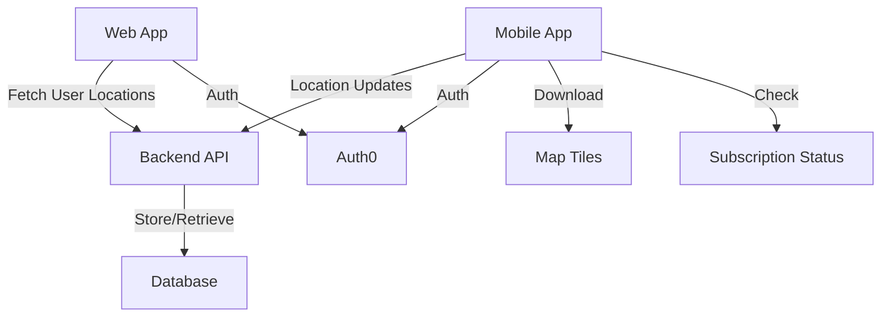

# GPS Tracking Feature Implementation Plan

## Overview

This document outlines the implementation plan for adding GPS tracking functionality to the presentation mode of our mapping application. The feature will allow users to track their location on maps, with the ability to share this location with others viewing the same route.

## Table of Contents

1. [Feature Requirements](#feature-requirements)
2. [Technical Architecture](#technical-architecture)
3. [Mobile App Implementation](#mobile-app-implementation)
4. [Background Location Tracking](#background-location-tracking)
5. [Offline Capabilities](#offline-capabilities)
6. [Payment System](#payment-system)
7. [Implementation Phases](#implementation-phases)
8. [Technical Considerations](#technical-considerations)

## Feature Requirements

The GPS tracking feature will provide:

- User authentication in presentation mode
- Real-time location tracking on maps
- Ability to download maps for offline use
- Background location tracking with periodic updates (hourly)
- Sharing location data with other users viewing the same route
- Premium access via a subscription model

## Technical Architecture

### Overall System Design

### Components

1. **Mobile App (React Native)**
   - Cross-platform (iOS & Android)
   - Location tracking capabilities
   - Offline map support
   - Authentication integration

2. **Web App (Existing)**
   - Display user locations on maps
   - Subscription management
   - Payment processing

3. **Backend Services**
   - User location storage and retrieval
   - Authentication validation
   - Subscription status checking

## Mobile App Implementation

### React Native Approach

React Native is the recommended approach for the mobile app because:

- Reuse of existing React code and components
- Cross-platform support (iOS and Android)
- Native access to device GPS capabilities
- Ability to implement background location tracking
- Support for offline map caching

### Key Libraries

- `react-native-maps` or `@mapbox/react-native-mapbox-gl` for map rendering
- `react-native-background-geolocation` for efficient location tracking
- `@react-native-async-storage/async-storage` for offline data storage
- `react-native-maps-offline` for offline map tile caching

## Background Location Tracking

### Implementation Strategy

The app will implement battery-efficient location tracking:

- Hourly location updates to minimize battery impact (0.1-0.2% per hour)
- Use of "significant location change" monitoring when possible
- Activity recognition to pause updates when stationary
- Batched location data transmission to reduce network usage

### iOS Background Restrictions

iOS has stricter policies on background processes:

- Must declare "Location updates" in app capabilities
- Must request and justify "Always" location permission
- System may throttle updates based on battery conditions
- Periodic user reminders about background location usage

### Handling Restrictions

To work within iOS constraints:

- Implement deferred location updates
- Use significant-change location service
- Schedule background tasks appropriately
- Provide clear user value proposition for location tracking

## Offline Capabilities

### Map Caching

- Download and store map tiles for specific regions
- Implement local storage management for potentially large map data
- Prioritize essential map data for limited storage environments

### Offline Data Handling

- Store location updates locally when offline
- Implement sync mechanism when connection is restored
- Cache route data for offline viewing

## Payment System

### Web-Based Payment Model

To avoid App Store's 15-30% commission:

- Implement subscription management on the web platform
- Use payment processors like Stripe or PayPal
- Store subscription status in the user database
- Check subscription status via API in the mobile app

### App Store Policy Compliance

What's allowed:
- Having users pay on your website
- Checking subscription status in your app
- Providing different functionality based on subscription status
- Mentioning that premium features exist

What's not allowed:
- Directly linking to your payment page from the app
- Explaining in the app how to pay outside the App Store
- Using language like "avoid App Store fees" in your app

### Implementation Strategy

1. **Web Platform**
   - Implement subscription management in the existing web app
   - Store subscription status in the user database

2. **Mobile App**
   - Check subscription status on login
   - Enable/disable features based on subscription
   - Use compliant messaging about premium features

## Implementation Phases

### Phase 1: Basic GPS Tracking (4-6 weeks)

- Set up React Native project structure
- Implement basic location tracking in presentation mode
- Create user location display on maps
- Implement authentication in presentation mode

### Phase 2: Multi-user Tracking (3-4 weeks)

- Create server-side storage for user locations
- Implement real-time updates between users
- Add UI for seeing other users on the same route
- Implement subscription checking

### Phase 3: Offline & Background Capabilities (4-5 weeks)

- Add offline map caching
- Implement background location tracking
- Create battery-efficient update mechanisms
- Add sync capabilities for offline data

### Phase 4: Payment Integration & Refinement (3-4 weeks)

- Implement web-based subscription system
- Add subscription status checking in the app
- Refine UI/UX for premium features
- Testing and optimization

## Technical Considerations

### Battery Usage

- One location ping per hour has minimal battery impact (1-2% per day)
- Modern phones optimize GPS power usage significantly
- Using cell tower/WiFi positioning when high accuracy isn't needed

### Data Storage

- User locations require minimal storage (a few KB per update)
- Offline maps can be large (10-100MB depending on area)
- Consider incremental sync for offline data

### Privacy & Security

- Clear communication about location data usage
- Options to pause or disable tracking
- Secure storage of location history
- Compliance with privacy regulations

### Cross-Platform Consistency

- Ensure consistent experience across iOS and Android
- Account for platform-specific location permission models
- Handle background restrictions differently per platform

---

This implementation plan provides a roadmap for developing the GPS tracking feature in a way that balances functionality, user experience, and technical constraints while maximizing revenue through a web-based payment model.
