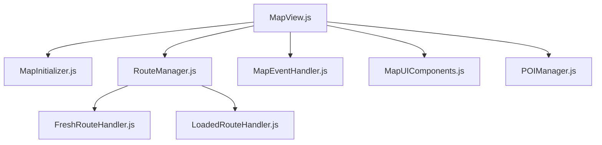

# MapView Refactoring Plan

## Overview

This document outlines the plan for refactoring the `MapView.js` file, which has grown too large and complex, making it difficult to handle errors and maintain. The refactoring will split the file into several smaller, focused modules with clear responsibilities.

## Current Issues

- **Size and Complexity**: The MapView.js file is over 1000 lines and handles too many responsibilities
- **Error Handling Challenges**: With so much functionality in one file, isolating and fixing errors is difficult
- **Route Type Mixing**: Need to better separate handling of fresh routes (newly uploaded GPX files) from loaded routes (retrieved from the database)

## Target Architecture

## Implementation Checklist

### Phase 1: Analysis and Preparation

- [x] 1.1. Create a backup of the current MapView.js file
- [ ] 1.2. Identify all dependencies and imports used in MapView.js
- [ ] 1.3. Map out component relationships and data flow
- [ ] 1.4. Create new directory structure for refactored components

### Phase 2: Extract Map Initialization

- [ ] 2.1. Create `useMapInitializer.js` hook
  - [ ] 2.1.1. Extract map creation and configuration logic
  - [ ] 2.1.2. Move terrain and 3D building setup
  - [ ] 2.1.3. Extract control addition logic
- [ ] 2.2. Create `MapControls.js` component
  - [ ] 2.2.1. Extract control rendering logic
  - [ ] 2.2.2. Handle responsive controls based on device type
- [ ] 2.3. Update MapView.js to use the new hook and component
- [ ] 2.4. Test map initialization in isolation

### Phase 3: Separate Route Handling

- [ ] 3.1. Create `useRouteManager.js` hook
  - [ ] 3.1.1. Extract route state management logic
  - [ ] 3.1.2. Add coordination between fresh and loaded routes
- [ ] 3.2. Create `FreshRouteHandler.js` component
  - [ ] 3.2.1. Extract fresh route rendering logic
  - [ ] 3.2.2. Move renderRouteOnMap function
  - [ ] 3.2.3. Handle route color updates
- [ ] 3.3. Create `LoadedRouteHandler.js` component
  - [ ] 3.3.1. Extract loaded route handling logic
  - [ ] 3.3.2. Integrate with RouteLayer component
- [ ] 3.4. Update MapView.js to use the new route handling components
- [ ] 3.5. Test route rendering for both fresh and loaded routes

### Phase 4: Centralize Event Handling

- [ ] 4.1. Create `useMapEvents.js` hook
  - [ ] 4.1.1. Extract mousemove and click event handlers
  - [ ] 4.1.2. Move hover marker logic
  - [ ] 4.1.3. Centralize map state change notifications
- [ ] 4.2. Create `HoverMarker.js` component
  - [ ] 4.2.1. Extract hover marker rendering logic
  - [ ] 4.2.2. Handle coordinate updates
- [ ] 4.3. Update MapView.js to use the new event handling hook
- [ ] 4.4. Test event handling in isolation

### Phase 5: Refactor POI Logic

- [ ] 5.1. Create `usePOIManager.js` hook
  - [ ] 5.1.1. Extract POI state management logic
  - [ ] 5.1.2. Move POI creation and update functions
- [ ] 5.2. Create `POIManager.js` component
  - [ ] 5.2.1. Extract POI rendering logic
  - [ ] 5.2.2. Handle POI interactions
  - [ ] 5.2.3. Manage POI drag and drop
- [ ] 5.3. Update MapView.js to use the new POI management components
- [ ] 5.4. Test POI functionality in isolation

### Phase 6: Organize UI Components

- [ ] 6.1. Create `MapUIComponents.js` file
  - [ ] 6.1.1. Extract header and sidebar rendering
  - [ ] 6.1.2. Move loading indicator logic
- [ ] 6.2. Update MapView.js to use the new UI components
- [ ] 6.3. Test UI components in isolation

### Phase 7: Simplify Main Component

- [ ] 7.1. Refactor MapView.js to be an orchestration component
  - [ ] 7.1.1. Remove extracted logic
  - [ ] 7.1.2. Compose the new components
  - [ ] 7.1.3. Pass necessary props and context
- [ ] 7.2. Clean up imports and dependencies
- [ ] 7.3. Add proper documentation
- [ ] 7.4. Test the fully refactored MapView component

### Phase 8: Integration Testing and Refinement

- [ ] 8.1. Test all components working together
- [ ] 8.2. Verify that all original functionality is preserved
- [ ] 8.3. Check for any performance issues
- [ ] 8.4. Refine component interfaces as needed
- [ ] 8.5. Update documentation with any changes

## Component Responsibilities

### MapView.js (simplified)
- Main component that orchestrates the other components
- Maintains the map reference and basic state
- Renders the UI structure

### MapInitializer.js
- Handles map creation and initialization
- Sets up map controls and basic configuration
- Manages map style and terrain

### RouteManager.js
- Coordinates between fresh and loaded routes
- Maintains route state and selection
- Delegates rendering to appropriate handlers

### FreshRouteHandler.js
- Handles newly uploaded GPX routes
- Processes and renders fresh routes directly on the map
- Manages route color and styling for fresh routes

### LoadedRouteHandler.js
- Handles routes loaded from the database
- Uses RouteLayer component for rendering
- Manages route visibility and focus

### MapEventHandler.js
- Centralizes event handling (click, hover, etc.)
- Manages hover markers and coordinates
- Handles map state changes

### POIManager.js
- Manages POI creation, editing, and deletion
- Handles POI drag and drop functionality
- Coordinates with POI context

### MapUIComponents.js
- Organizes UI components like headers, sidebars, etc.
- Manages UI state and interactions

## Benefits

1. **Improved Maintainability**: Smaller, focused files are easier to understand and modify
2. **Better Error Isolation**: Issues can be traced to specific modules
3. **Enhanced Testability**: Separated concerns allow for more targeted testing
4. **Clearer Responsibility Boundaries**: Each module has a well-defined purpose
5. **Easier Onboarding**: New developers can understand the system more quickly
